  

  
  
  
  

# Platinoff — Mad Developers Inc.

> **...actually one guy.** One guy learning Rust with Cursor AI, running an always-on collection of registered products — a decentralized AI power grid for GPU compute and Solana mining, a vision hub, local LLMs, and the tooling that keeps every process alive.

**I build in public.** Everything here is Rust-first (95–100%), versioned as one commit per drip, and supervised by an always-on watchdog at `127.0.0.1:9999`.

---

## 🌀 The galaxy

Every repository is a living node wired to the heart of it — **GSV**:

  

## 🛠 What I build

| Repo | What it does | Runs at |
|---|---|---|
| [**GSV**](https://github.com/platinoff/GSV) | Galaxy StarWalker Vision — the hub: vision map, ticket board, keep-live watchdog, MCP server | `:9999` |
| [**poolAI**](https://github.com/platinoff/poolAI) | Hybrid decentralized pool grid for AI power + Solana mining | `:8080` |
| [**llama-rs**](https://github.com/platinoff/llama-rs) | Local LLM runner (Qwen 27B) with a live heartbeat | local |
| [**OmniRoute**](https://github.com/platinoff/OmniRoute) | Free AI gateway — 290 providers, 90+ free tiers, one endpoint | gateway |
| [**LinFS**](https://github.com/platinoff/LinFS) | Linux filesystems on Windows, 100% Rust (no WSL, no Python) | `:9998` |
| [**ORR_DESKTOP**](https://github.com/platinoff/ORR_DESKTOP) | Rust desktop remote control | desktop |
| [**rebook**](https://github.com/platinoff/rebook) | Ebook viewer (KDP publishing toolkit) | desktop |

**Always live** → keep-live probes GSV · telenetis (`:9800`) · llama-rs · OmniRoute in one heartbeat, fail-open. The Telegram Mini App (**telenetis**) bridges the Godfather channel to the board.

## ⚡ Stack

Rust (`tokio` · `axum`) · WASM 0–5% · HTML/CSS/JS glue · Solana · Cursor AI · MSYS2 bash · MCP / OpenCode / Grok

## 🔭 Currently

- Building the **poolAI decentralized grid** (GPU + Solana stage)
- Keeping the **GSV vision hub** registered and in sync across sessions
- Wiring **llama-rs** local inference into the shared OmniRoute catalog

## 💖 Support

All of this is one guy, open-source, Rust-first. If anything here helped you, a star or a coffee means a lot:

🐙 **GitHub Sponsors** — one-off or monthly, zero platform fee  
⭐ **Star a repo** — the galactic way to say thanks  
☀️ **Solana (SOL):** `GcdgNtdE8NEk3z9sQ5jXv2tqguZjSYqPqNAtjsjPNJx8`

- [Sponsor](https://github.com/sponsors/platinoff) · [Facebook group](https://www.facebook.com/groups/madevinc) · [Repositories](https://github.com/platinoff?tab=repositories)